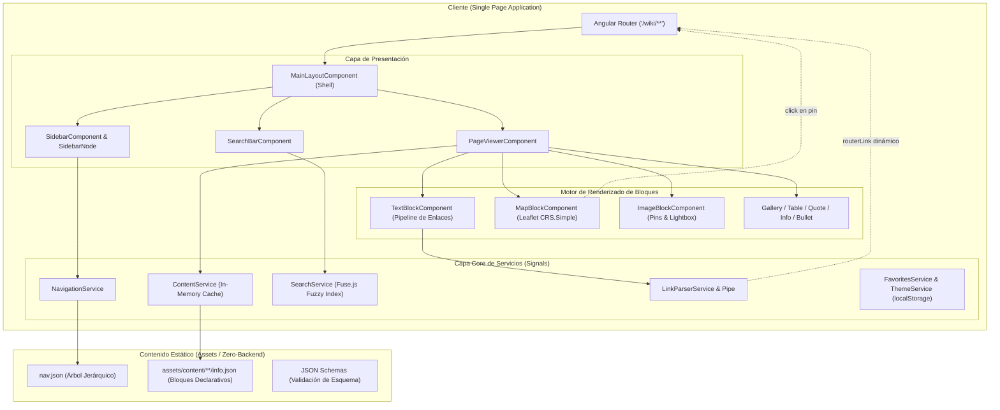

# 📖 Eberron Wiki SPA

[](https://angular.dev/)
[](https://www.typescriptlang.org/)
[](https://material.angular.io/)
[](https://vitest.dev/)
[](https://leafletjs.com/)
[](https://www.fusejs.io/)
[]()

Un motor de wiki estática moderna (SPA), tipado de extremo a extremo, desacoplado y sin backend (*Zero-Backend*), desarrollado sobre **Angular 21+** y arquitectura de componentes *Standalone*. 

El proyecto está diseñado como un **framework de renderizado declarativo de contenido** impulsado por JSON estructurado (*Headless Content Architecture*), orientado originalmente al universo de campaña y lore de *Eberron* (D&D), pero concebido arquitectónicamente para ser extensible a cualquier base de conocimiento interactiva.

---

## 📑 Tabla de Contenidos

- [Visión General del Proyecto](#-visión-general-del-proyecto)
- [Stack Tecnológico](#-stack-tecnológico)
- [Decisiones Clave de Arquitectura](#-decisiones-clave-de-arquitectura)
  - [1. Reactividad Fina con Signals (vs. Stores Globales)](#1-reactividad-fina-con-signals-vs-stores-globales)
  - [2. Renderizado Modular Basado en Bloques (Block-Driven UI)](#2-renderizado-modular-basado-en-bloques-block-driven-ui)
  - [3. Pipeline Seguro de Wikilinks sin `innerHTML` ni XSS](#3-pipeline-seguro-de-wikilinks-sin-innerhtml-ni-xss)
  - [4. Cartografía Interactiva de Fantasía con Leaflet (`L.CRS.Simple`)](#4-cartografía-interactiva-de-fantasía-con-leaflet-lcrssimple)
  - [5. Arquitectura Zero-Backend con Caché en Memoria](#5-arquitectura-zero-backend-con-caché-en-memoria)
  - [6. Búsqueda Difusa en Cliente con Fuse.js e Indexación Lazy](#6-búsqueda-difusa-en-cliente-con-fusejs-e-indexación-lazy)
- [Diagrama de Arquitectura](#-diagrama-de-arquitectura)
- [Estructura del Proyecto](#-estructura-del-proyecto)
- [Esquema de Contenidos y Extensibilidad](#-esquema-de-contenidos-y-extensibilidad)
  - [Tipos de Bloques Disponibles](#tipos-de-bloques-disponibles)
  - [Cómo Añadir un Nuevo Tipo de Bloque](#cómo-añadir-un-nuevo-tipo-de-bloque)
- [Instalación y Comandos](#-instalación-y-comandos)

---

## 🎯 Visión General del Proyecto

A diferencia de los CMS tradicionales (MediaWiki, WordPress, Docusaurus) que requieren motores de base de datos relacionales, ejecución en servidor (SSR/PHP) o procesos de compilación estática pesados por cada cambio de página (SSG), **Eberron Wiki** adopta el patrón de **Single Page Application (SPA) con carga de contenido desacoplado**:

- **Cero dependencias de servidor**: El cliente web se distribuye como un artefacto estático (HTML/JS/CSS).
- **Contenido como datos puros**: El contenido reside en archivos estáticos JSON bajo `src/assets/content/`, tipados y validados mediante [JSON Schemas](src/assets/content/schemas/).
- **Navegación nativa fluida**: Las rutas wildcard dinámicas resuelven la ruta de lectura de forma instantánea sin refrescos de página completos ni re-renderizados innecesarios.

---

## 🛠️ Stack Tecnológico

| Tecnología | Versión | Rol en el Proyecto | Justificación Técnica |
| :--- | :--- | :--- | :--- |
| **Angular** | `^21.1.0` | Framework Core SPA | Adopción de la era moderna de Angular: arquitectura 100% *Standalone*, nuevo flujo de control sintáctico (`@if`, `@for`, `@switch`), inputs/viewChild reactivos y compatibilidad *Zoneless*. |
| **Angular Signals** | Integrado | Gestión de Estado Reactivo | Reactividad granular por señal (`signal()`, `computed()`, `toSignal()`). Elimina la sobrecarga de dependencias pesadas de gestión de estado. |
| **TypeScript** | `~5.9.2` | Lenguaje & Tipado Estricto | Garantía de tipado estricto mediante uniones discriminadas (*Discriminated Unions*) para los bloques de contenido y contratos JSON. |
| **Angular Material & CDK** | `^21.2.14` | Componentes UI & Layout | Implementación accesible del layout (`MatSidenav`, iconos, botones, chips, spinners), completamente adaptada a la reactividad de Signals. |
| **Leaflet.js** | `^1.9.4` | Cartografía Interactiva | Renderizado de mapas de alta resolución mediante proyección plana `L.CRS.Simple`, con marcadores basados en porcentajes relativos y enlaces de enrutamiento SPA. |
| **Fuse.js** | `^7.5.0` | Motor de Búsqueda Fuzzy | Búsqueda difusa en cliente tolerante a erratas fonéticas y ortográficas, sin necesidad de infraestructura de búsqueda externa (Elastic/Algolia). |
| **SCSS + Design Tokens** | — | Estilos y Tematización | Variables CSS estructuradas (`_tokens.scss`) con soporte nativo de modo claro y oscuro. |
| **Vitest & jsdom** | `^4.0.8` | Test Runner Unitario | Sustitución moderna de Karma/Jasmine por Vitest para ejecuciones instantáneas de pruebas unitarias bajo entorno ESM. |

---

## 💡 Decisiones Clave de Arquitectura

### 1. Reactividad Fina con Signals (vs. Stores Globales)

Para una plataforma documental y de lectura interactiva, integrar soluciones como NgRx Store, Akita o Redux introduce una complejidad innecesaria de reducers, actions y effects para un flujo de datos que es predominantemente **unidireccional y de solo lectura**.

- Se optó por una arquitectura **Signal-First**:
  - `ContentService` maneja la caché y los estados asíncronos mediante señales derivadas.
  - `PageViewerComponent` orquesta el contenido mediante `computed()`, derivando reactivamente la tabla de contenidos (ToC), los bloques laterales contextuales y el estado de favoritos a partir del recurso activo.
  - La sincronización de preferencias (tema, favoritos, historial) se encapsula en servicios aislados (`FavoritesService`, `ThemeService`, `HistoryService`) que sincronizan sus `signal()` con `localStorage`.

### 2. Renderizado Modular Basado en Bloques (Block-Driven UI)

En lugar de almacenar HTML plano o cadenas gigantes de Markdown, el contenido se modela como una **unión discriminada de bloques**:

```typescript
// src/app/core/models/block.model.ts
export type ContentBlock =
  | TextBlock
  | GalleryBlock
  | BulletBlock
  | ImageBlock
  | QuoteBlock
  | InfoBlock
  | TableBlock
  | SeparatorBlock
  | RelatedBlock
  | MapBlock;

export interface BaseBlock {
  type: string;
  id: string;
}
```

#### ¿Por qué este enfoque?
1. **Type Narrowing automático**: TypeScript valida exhaustivamente cada variante según su propiedad discriminante `type`.
2. **Control Flow nativo**: El template del visor resuelve los componentes mediante la directiva moderna `@switch (block.type)`:
   ```html
   @for (block of nonRelatedBlocks(); track block.id) {
     @switch (block.type) {
       @case ('text')      { <app-text-block [block]="$any(block)" /> }
       @case ('bullet')    { <app-bullet-block [block]="$any(block)" /> }
       @case ('image')     { <app-image-block [block]="$any(block)" /> }
       @case ('map')       { <app-map-block [block]="$any(block)" /> }
       @case ('gallery')   { <app-gallery [block]="$any(block)" /> }
       // ...
     }
   }
   ```
3. **Desacoplamiento total**: Los componentes visuales no conocen el origen de los datos, solo declaran un `input.required<TBlock>()`.

### 3. Pipeline Seguro de Wikilinks sin `innerHTML` ni XSS

Una característica fundamental de una wiki son los enlaces internos bidireccionales con sintaxis estilo wiki: `[[ruta/destino|Texto visible]]` o `[[destino]]`.

#### El problema tradicional:
La solución habitual suele ser parsear la cadena a HTML e inyectarla con `[innerHTML]` y `DomSanitizer.bypassSecurityTrustHtml()`. Esto acarrea dos problemas graves:
- **Riesgo de seguridad**: Abre la puerta a ataques XSS si el contenido incluye atributos o etiquetas no saneadas.
- **Pérdida de la SPA**: Los enlaces `<a href="...">` inyectados vía `innerHTML` provocan recargas completas de la página en el navegador en lugar de utilizar el `Router` de Angular.

#### Nuestra solución:
Un pipeline tokenizador puro en dos pasadas (`LinkParserService`) combinado con un pipe puro (`ParseInternalLinksPipe`):
1. **Paso 1 (Tokenización)**: Expresiones regulares descomponen el texto en una secuencia ordenada de segmentos estructurados:
   - `TextSegmentInternalLink`: Contiene `slug` normalizado y `label`.
   - `TextSegmentExternalLink`: Contiene `url` validada bajo protocolos seguros (`http`, `https`, `mailto`) y `label`.
   - `TextSegmentString`: Segmentos de texto base con metadatos de formato inline (negrita/cursiva).
2. **Paso 2 (Renderizado declarativo)**: En la plantilla del componente de texto, cada segmento se renderiza como elementos Angular nativos:
   ```html
   @for (segment of paragraph | parseInternalLinks; track $index) {
     @if (segment.isLink) {
       @if (segment.isExternal) {
         <a [href]="segment.url" class="external-link" target="_blank" rel="noopener noreferrer">
           {{ segment.label }}
         </a>
       } @else {
         <a [routerLink]="'/wiki/' + segment.slug" class="internal-link">
           {{ segment.label }}
         </a>
       }
     } @else {
       <span [class.bold]="segment.isBold" [class.italic]="segment.isItalic">
         {{ segment.text }}
       </span>
     }
   }
   ```
*Resultado*: 100% de navegación interna mediante `routerLink`, protección XSS intrínseca por Angular y sin recargas de página.

### 4. Cartografía Interactiva de Fantasía con Leaflet (`L.CRS.Simple`)

Los motores cartográficos habituales están pensados para el globo terráqueo (coordenadas geográficas latitud/longitud bajo proyecciones EPSG:3857). En mundos de ficción y mapas de rol, esto genera distorsiones y desajustes.

- **Proyección Plana (`L.CRS.Simple`)**: Se configura Leaflet para tratar la imagen del mapa como un plano euclídeo bidimensional continuo.
- **Coordenadas porcentuales relativas (`x: 0-100`, `y: 0-100`)**: Los pines no se ubican en coordenadas de píxeles rígidas. Al cargarse la imagen, el componente calcula la relación de aspecto real de la imagen original y normaliza las dimensiones (ej. base fija de 1000 unidades y altura proporcional). Esto hace que los mapas y los pines sean **completamente responsive y resistentes a cambios de resolución de imagen**.
- **Pines con marcado dinámico (`L.divIcon`)**: Cada pin es un nodo interactivo con soporte para eventos click que disparan el enrutador SPA (`router.navigateByUrl('/wiki/' + pin.linkSlug)`).
- **Modo Inmersivo**: Soporte integrado para pantalla completa (*fullscreen overlay*), atajos de teclado (`Esc`) y recálculo automático de dimensiones del lienzo mediante `invalidateSize()`.

### 5. Arquitectura Zero-Backend con Caché en Memoria

Para garantizar un mantenimiento cero y costes de servidor nulos:
- Las páginas se organizan jerárquicamente en `src/assets/content/<slug>/info.json`.
- `ContentService` actúa como broker de datos: antes de realizar una petición HTTP hacia el asset estático, consulta un diccionario en memoria (`Map<string, PageContent>`).
- Las páginas visitadas quedan cacheadas para el resto de la sesión, haciendo que la navegación de regreso sea instantánea (0 ms de latencia de red).
- Permite empaquetar la aplicación y desplegarla en cualquier hosting estático (GitHub Pages, Netlify, Vercel, S3) o integrarla directamente en un servidor local para partidas virtuales como Foundry VTT.

### 6. Búsqueda Difusa en Cliente con Fuse.js e Indexación Lazy

En lugar de consultar un endpoint de backend para el buscador:
- `SearchService` recorre el árbol de navegación expuesto por `NavigationService` (`nav.json`).
- La indexación se ejecuta de manera **diferida (lazy)** la primera vez que el usuario interactúa con la barra de búsqueda, evitando ralentizar el arranque inicial de la aplicación (*Time to Interactive* óptimo).
- Fuse.js indexa en memoria:
  - Títulos principales
  - Alias alternativos (`aliases`)
  - Etiquetas temáticas (`tags`)
  - Resumen automático extraído de los primeros bloques de texto
- Tolerancia a erratas (*threshold: 0.4*) adaptada a la complejidad léxica de nombres propios de fantasía.

---

## 📐 Diagrama de Arquitectura



---

## 📂 Estructura del Proyecto

El código sigue un principio estricto de **dependencia unidireccional**: el directorio `core/` no conoce componentes visuales de `blocks/` o `pages/`, lo que permite evolucionar la capa visual sin acoplamiento.

```text
src/
├── app/
│   ├── app.config.ts                   # Bootstrap de proveedores (Router, HttpClient, Animations)
│   ├── app.routes.ts                   # Definición de rutas raíz y wildcard para la wiki
│   ├── app.ts                          # Componente raíz de la aplicación
│   │
│   ├── blocks/                         # Catálogo de bloques de contenido independientes
│   │   ├── bullet-block/               # Listas ordenadas e ítems destacados
│   │   ├── gallery/                    # Galerías de imágenes con visualizador lightbox
│   │   ├── image-block/                # Bloque de imagen con soporte de pines y zoom
│   │   ├── info-block/                 # Callouts informativos (note, warning, lore)
│   │   ├── map-block/                  # Mapa interactivo Leaflet CRS.Simple
│   │   ├── quote-block/                # Citas de ambientación y autores
│   │   ├── related-block/              # Enlaces a páginas y recursos relacionados
│   │   ├── separator-block/            # Divisores de sección estilizados
│   │   ├── table-block/                # Tablas de datos tabulares
│   │   └── text-block/                 # Texto enriquecido con pipeline de wikilinks
│   │
│   ├── core/                           # Servicios singleton y modelos de dominio
│   │   ├── models/
│   │   │   ├── block.model.ts          # Tipos y unión discriminada ContentBlock
│   │   │   ├── nav-node.model.ts       # Modelo de nodo del árbol de navegación
│   │   │   ├── page.model.ts           # Interfaz de datos de una página
│   │   │   └── search-index-entry.model.ts
│   │   └── services/
│   │       ├── content.service.ts      # Fetcher de JSONs con caché en memoria
│   │       ├── favorites.service.ts    # Gestión reactiva de marcadores en localStorage
│   │       ├── history.service.ts      # Registro de historial de navegación reciente
│   │       ├── link-parser.service.ts  # Tokenizador de wikilinks y markdown inline
│   │       ├── navigation.service.ts   # Carga y estado del árbol de navegación
│   │       ├── search.service.ts       # Búsqueda difusa mediante Fuse.js
│   │       ├── theme.service.ts        # Control del modo oscuro / claro
│   │       └── unlockable-content.service.ts # Control de contenido desbloqueable por hitos
│   │
│   ├── layout/                         # Componentes estructurales de la interfaz
│   │   ├── breadcrumb/                 # Migas de pan de navegación
│   │   ├── main-layout/                # Shell general (header, sidenav responsive)
│   │   ├── search-bar/                 # Input y menú flotante de búsqueda fuzzy
│   │   └── sidebar/                    # Árbol de navegación recursivo (sidebar-node)
│   │
│   ├── pages/
│   │   └── page-viewer/                # Orquestador: resuelve slug -> JSON -> bloques
│   │
│   └── shared/                         # Elementos compartidos reutilizables
│       └── pipes/
│           └── parse-internal-links.pipe.ts # Pipe puro que expone LinkParserService
│
├── assets/
│   ├── content/                        # Datos JSON del contenido
│   │   ├── schemas/                    # JSON Schemas (page.schema.json, nav.schema.json)
│   │   ├── nav.json                    # Estructura del árbol jerárquico de navegación
│   │   └── [sección]/[página]/info.json
│   └── img/                            # Imágenes rasterizadas y mapas
│
└── styles/
    ├── _tokens.scss                    # Variables CSS (paleta, espaciados, temas)
    └── styles.scss                     # Estilos globales y reset
```

---

## 🧩 Esquema de Contenidos y Extensibilidad

### Tipos de Bloques Disponibles

| Tipo (`type`) | Modelo TypeScript | Características Principales |
| :--- | :--- | :--- |
| `text` | `TextBlock` | Párrafos de texto, títulos de sección, autolinks `[[slug\|label]]`, enlaces markdown y markdown inline (`**negrita**`, `*cursiva*`). |
| `bullet` | `BulletBlock` | Listas de puntos con títulos de sección opcionales. |
| `image` | `ImageBlock` | Alineación (`left`, `center`, `right`), tamaños (`small`, `medium`, `full`), pies de foto, lightbox integrado y pines interactivos con enlaces SPA. |
| `gallery` | `GalleryBlock` | Cuadrícula de múltiples imágenes con visualización ampliada. |
| `quote` | `QuoteBlock` | Bloque de cita destacada con autor atribuible. |
| `info` | `InfoBlock` | Cajas de notas destacadas con variantes semánticas: `note`, `warning` y `lore`. |
| `table` | `TableBlock` | Cabeceras dinámicas y filas tabulares con estilo cebra. |
| `separator` | `SeparatorBlock` | Divisor ornamental entre secciones temáticas. |
| `related` | `RelatedBlock` | Enlaces a páginas vinculadas renderizadas en el sidebar derecho contextual. |
| `map` | `MapBlock` | Lienzo interactivo Leaflet con soporte de pantalla completa, pines con tooltip y navegación. |

### Cómo Añadir un Nuevo Tipo de Bloque

Gracias a la unión discriminada y al diseño desacoplado, añadir un nuevo tipo de bloque (por ejemplo, un bloque de audio `AudioBlock` o una cronología `TimelineBlock`) requiere únicamente **3 pasos**:

1. **Definir la interfaz** en [`src/app/core/models/block.model.ts`](src/app/core/models/block.model.ts):
   ```typescript
   export interface AudioBlock extends BaseBlock {
     type: 'audio';
     src: string;
     title?: string;
   }
   
   // Añadirlo a la unión discriminada:
   export type ContentBlock = ... | AudioBlock;
   ```

2. **Crear el componente standalone**:
   ```typescript
   @Component({
     selector: 'app-audio-block',
     standalone: true,
     template: `<audio controls [src]="block().src"></audio>`
   })
   export class AudioBlockComponent {
     readonly block = input.required<AudioBlock>();
   }
   ```

3. **Registrar el caso** en el `@switch` de [`page-viewer.component.ts`](src/app/pages/page-viewer/page-viewer.component.ts):
   ```html
   @case ('audio') {
     <app-audio-block [block]="$any(block)" />
   }
   ```
El compilador de TypeScript garantiza la validez del contrato en todo momento.

---

## 🚀 Instalación y Comandos

### Requisitos Previos

- **Node.js**: `v20.x` o superior (LTS recomendado)
- **npm**: `v10.x` o superior

### Instalación de Dependencias

```bash
git clone https://github.com/tu-usuario/eberron-wiki.git
cd eberron-wiki
npm install
```

### Servidor de Desarrollo

Inicia el servidor local de desarrollo con recarga en caliente:

```bash
npm start
# o
npm run dev
```

Navega a `http://localhost:4200/`. La aplicación se recargará automáticamente al modificar cualquier archivo de código o contenido.

### Compilación para Producción

Genera el build estático optimizado en la carpeta `dist/`:

```bash
npm run build
```

El resultado es un conjunto de archivos estáticos listo para ser servido por cualquier servidor HTTP (Nginx, Apache, Caddy) o plataforma de hosting estático (GitHub Pages, Netlify, Vercel, Cloudflare Pages).

### Pruebas Unitarias

Ejecuta la suite de pruebas unitarias con **Vitest**:

```bash
npm test
```
